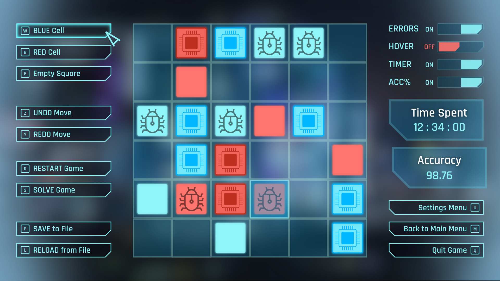

README - TAKUZU PROJECT
-----------------------

[](https://github.com/TLacault/takuzu)

## About The Project
* **C implementation of the Takuzu game.**
* **Made by [Tim Lacault](https://github.com/TLacault), [Hugo Lumet](https://github.com/Alhmass) and [Alexandre Lou-Poueyou](https://github.com/AlexLoup33)**


## Technologies & Tools

[](https://clang.llvm.org/) [](https://ba-sh.com/fr/fr/) [](https://cmake.org/)

[](https://developer.mozilla.org/en-US/docs/Web/HTML) [](https://developer.mozilla.org/en-US/docs/Web/CSS) [](https://sass-lang.com/) [](https://developer.mozilla.org/en-US/docs/Web/JavaScript) [](https://webassembly.org/)

[](https://code.visualstudio.com/) [](https://git-scm.com/) [](https://github.com/)  [](https://gitlab.com/) [](https://www.linux.org/) [](https://www.archlinux.org/)


## Preview

[](https://github.com/TLacault/takuzu)

[](https://github.com/TLacault/takuzu)


## Clone The Repository
* **Clone with HTML**

```
git clone https://github.com/TLacault/takuzu.git
```

* **Clone with SSH**

```
git clone git@github.com:TLacault/takuzu.git
```

## Prequisite

* **CMake**
* **SDL2**
* **SDL2_image**
* **SDL2_ttf**
* **SDL2_mixer**


## Usage
* **Build the project**

```
mkdir build; cd build; cmake ..; make
```

* **Run the game**

```
./game_sdl
```

* **Play the demo version online** [here](https://tim-lacault.emi.u-bordeaux.fr/web-ub01c/game.html)

## Contact
* **Tim Lacault - tim.lacault@etu.u-bordeaux.fr**
* **Hugo Lumet - hugo.lumet@etu.u-bordeaux.fr**
* **Alexandre Lou-Poueyou - alexandre.lou-poueyou@etu.u-bordeaux.fr**
